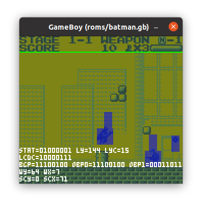
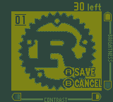
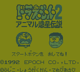
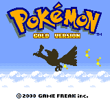
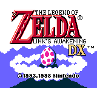
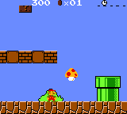
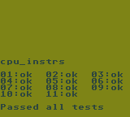
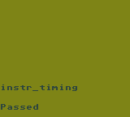
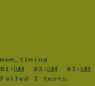

# `rust-gameboy2`

[](https://travis-ci.org/germangb/rust-gameboy2)

Attempt to rewrite the old [`germangb/rust-gameboy`] emulator project.

[`germangb/rust-gameboy`]: https://github.com/germangb/rust-gameboy











## Integration tests

```bash
cargo test --test cpu_instrs
cargo test --test instr_timing
cargo test --test mem_timing
```





## WASM

```bash
cd wasm/           # wasm module project
wasm-pack build    # build wasm module
cd www/            # web server directory 
npm run start      # start server on port 8080
```


## References

- http://problemkaputt.de/pandocs.htm
- https://gbdev.gg8.se/wiki/
- https://github.com/AntonioND/giibiiadvance/blob/master/docs/TCAGBD.pdf
- https://gekkio.fi/files/gb-docs/gbctr.pdf
- https://github.com/gbdev/awesome-gbdev
- https://github.com/AntonioND/gbcam-rev-engineer/tree/master/doc
